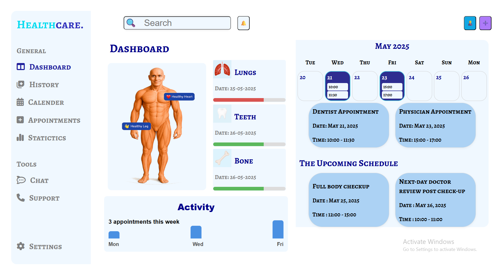

# 🩺 Fitpeo Frontend Assignment

A simple React-based health dashboard built for the Fitpeo assignment.

It uses static mock data to display:

- Calendar View – Weekly calendar (May 20–26, 2025)
- Health Status Cards – Lungs, Teeth, Bones
- Activity Feed – Basic bar chart

Built with React + Vite and plain CSS.
